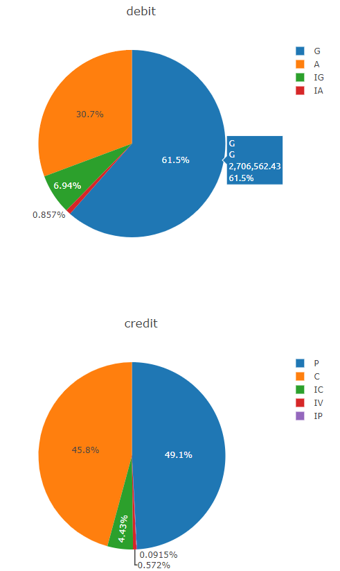

# Accounting
### Summary
This repository contains a dasboard that depicts the amount and percentage for every debit, credit and balance by account or its type in multiple scatter plots and pie charts. 
### Technical Details
In order to run the code, it is required: 
* Google Chrome, Firefox or any other Internet Explorer 
* Utilizes Python, JSON, JavaScript, Plotly, HTML. 
### Screenshots
For example, the interest account for an investment fund was tracked as follow: 
PlotlyScatterPlot.png 
  
The balance per accounts or their type are shown as follow:  
BalancePerAccount.png 
  
BalancePerTypeOfAccount.png 
  
### Explanations 
The outcome is shown in screenshots for reference purpose of the public. 
# Accounting
The pie charts depict actual and forecast transactions recorded into a double entry accounting
system such as debits, credits and balances from October 10 th 2012 to June 14 th 2020. In the
dashboard, interactive scatter plots illustrate cumulative amounts in pesos, capability expenditure
in percentage and total sales per account or type of account. Tools used: Python, JSON, JavaScript,
Plotly, HTML, CSS.
